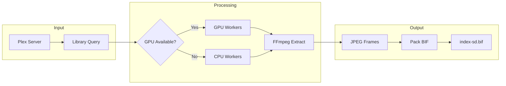

<!-- Back to top link -->
<a id="readme-top"></a>

<!-- PROJECT SHIELDS -->
<div align="center">

[![Contributors][contributors-shield]][contributors-url]
[![Forks][forks-shield]][forks-url]
[![Stargazers][stars-shield]][stars-url]
[![Issues][issues-shield]][issues-url]
[![MIT License][license-shield]][license-url]
[![Docker Pulls][docker-shield]][docker-url]
[![codecov][codecov-shield]][codecov-url]

</div>

<!-- PROJECT LOGO -->
<div align="center">
  

  <h1 align="center">Plex Generate Previews</h1>

  <p align="center">
    GPU-accelerated video preview thumbnail generation for Plex Media Server
    <br />
    <a href="docs/README.md"><strong>Explore the docs »</strong></a>
    <br />
    <br />
    <a href="#-quick-start">Quick Start</a>
    ·
    <a href="https://github.com/stevezau/plex_generate_vid_previews/issues/new?labels=bug">Report Bug</a>
    ·
    <a href="https://github.com/stevezau/plex_generate_vid_previews/issues/new?labels=enhancement">Request Feature</a>
  </p>
</div>

<!-- TABLE OF CONTENTS -->
<details>
  <summary>📑 Table of Contents</summary>
  <ol>
    <li><a href="#-about">About</a></li>
    <li><a href="#-features">Features</a></li>
    <li><a href="#-quick-start">Quick Start</a></li>
    <li><a href="#-installation">Installation</a></li>
    <li><a href="#-gpu-support">GPU Support</a></li>
    <li><a href="#-documentation">Documentation</a></li>
    <li><a href="#-built-with">Built With</a></li>
    <li><a href="#-contributing">Contributing</a></li>
    <li><a href="#-license">License</a></li>
    <li><a href="#-acknowledgments">Acknowledgments</a></li>
  </ol>
</details>

---

## 🎯 About

Generates video preview thumbnails (BIF files) for Plex Media Server. These are the small images you see when scrubbing through videos in Plex.

**The Problem:** Plex's built-in preview generation is painfully slow.

**The Solution:** This tool uses GPU acceleration and parallel processing to generate previews **5-10x faster**.

### How It Works



<p align="right">(<a href="#readme-top">back to top</a>)</p>

---

## ✨ Features

| Feature | Description |
|---------|-------------|
| 🚀 **Multi-GPU** | NVIDIA, AMD, Intel, and Windows GPUs |
| ⚡ **Parallel Processing** | Configurable GPU and CPU worker threads |
| 🎮 **Hardware Acceleration** | CUDA, VAAPI, D3D11VA, VideoToolbox |
| 📚 **Library Filtering** | Process specific Plex libraries |
| 🎨 **Quality Control** | Adjustable thumbnail quality (1-10) |
| 🐳 **Docker Ready** | Pre-built images with GPU support |
| 🌐 **Web Dashboard** | Manage jobs, schedules, and status |
| ⏱️ **Scheduling** | Cron and interval-based automation |
| 📡 **Radarr/Sonarr** | Webhook integration for auto-processing on import |

<p align="right">(<a href="#readme-top">back to top</a>)</p>

---

## ⚡ Quick Start

### Docker (Recommended)

```bash
docker run -d \
  --name plex-generate-previews \
  --restart unless-stopped \
  -p 8080:8080 \
  --device /dev/dri:/dev/dri \
  -e PUID=1000 \
  -e PGID=1000 \
  -v /path/to/media:/media:ro \
  -v /path/to/plex/config:/plex:rw \
  -v /path/to/app/config:/config:rw \
  stevezzau/plex_generate_vid_previews:latest
```

Then open `http://YOUR_IP:8080`, retrieve the authentication token from container logs, and complete the setup wizard.

For Docker Compose, Unraid, local pip install, and GPU-specific setup:

- [Getting Started](docs/getting-started.md)
- [Configuration & API Reference](docs/reference.md)

<p align="right">(<a href="#readme-top">back to top</a>)</p>

---

## 📦 Installation

| Method | Best For | Guide |
|--------|----------|-------|
| **Docker** | Most users, easy GPU setup | [Getting Started](docs/getting-started.md) |
| **Docker Compose** | Managed deployments | [docker-compose.example.yml](docker-compose.example.yml) |
| **Unraid** | Unraid servers | [Getting Started — Unraid](docs/getting-started.md#unraid) |
| **Pip** | Local development | [Getting Started — Pip Install](docs/getting-started.md#pip-install) |

> [!IMPORTANT]
> Note the extra "z" in Docker Hub: [stevezzau/plex_generate_vid_previews](https://hub.docker.com/repository/docker/stevezzau/plex_generate_vid_previews)
> (stevezau was taken)

<p align="right">(<a href="#readme-top">back to top</a>)</p>

---

## 🎮 GPU Support

| GPU Type | Platform | Acceleration | Docker |
|----------|----------|--------------|--------|
| **NVIDIA** | Linux | CUDA/NVENC | `--gpus all` |
| **AMD** | Linux | VAAPI | `--device /dev/dri` |
| **Intel** | Linux | QuickSync/VAAPI | `--device /dev/dri` |
| **All** | Windows | D3D11VA | Native only |
| **Apple Silicon** | macOS | VideoToolbox | Native only |

For complete GPU setup, tuning, and troubleshooting:

- [Getting Started — GPU Acceleration](docs/getting-started.md#gpu-acceleration)
- [Guides & Troubleshooting](docs/guides.md#troubleshooting)

Check detected GPUs:

```bash
plex-generate-previews --list-gpus
```

<p align="right">(<a href="#readme-top">back to top</a>)</p>

---

## 📚 Documentation

| Document | Description |
|----------|-------------|
| [📖 Documentation Hub](docs/README.md) | Start here — architecture diagrams |
| [⚡ Getting Started](docs/getting-started.md) | Docker, GPU, Unraid, pip, devcontainer |
| [⚙️ Reference](docs/reference.md) | Configuration options & REST API |
| [📘 Guides](docs/guides.md) | Web interface, webhooks, FAQ, troubleshooting |

<p align="right">(<a href="#readme-top">back to top</a>)</p>

---

## 🛠️ Built With

<div align="center">

[![Python][python-shield]][python-url]
[![Docker][docker-tech-shield]][docker-tech-url]
[![FFmpeg][ffmpeg-shield]][ffmpeg-url]
[![Flask][flask-shield]][flask-url]
[![Gunicorn][gunicorn-shield]][gunicorn-url]

</div>

<p align="right">(<a href="#readme-top">back to top</a>)</p>

---

## 🤝 Contributing

Contributions are welcome! Please:

1. Fork the repository
2. Create a feature branch (`git checkout -b feature/amazing-feature`)
3. Commit changes (`git commit -m 'Add amazing feature'`)
4. Push to branch (`git push origin feature/amazing-feature`)
5. Open a Pull Request

<p align="right">(<a href="#readme-top">back to top</a>)</p>

---

## 📄 License

Distributed under the MIT License. See [LICENSE](LICENSE) for details.

<p align="right">(<a href="#readme-top">back to top</a>)</p>

---

## 🙏 Acknowledgments

- [Plex](https://www.plex.tv/) for the amazing media server
- [FFmpeg](https://ffmpeg.org/) for video processing
- [LinuxServer.io](https://www.linuxserver.io/) for the Docker base image
- [Rich](https://github.com/Textualize/rich) for beautiful terminal output
- All contributors and users

<p align="right">(<a href="#readme-top">back to top</a>)</p>

---

<div align="center">

Made with ❤️ by [stevezau](https://github.com/stevezau)

⭐ Star this repo if you find it useful!

</div>

<!-- MARKDOWN LINKS & IMAGES -->
[contributors-shield]: https://img.shields.io/github/contributors/stevezau/plex_generate_vid_previews.svg?style=for-the-badge
[contributors-url]: https://github.com/stevezau/plex_generate_vid_previews/graphs/contributors
[forks-shield]: https://img.shields.io/github/forks/stevezau/plex_generate_vid_previews.svg?style=for-the-badge
[forks-url]: https://github.com/stevezau/plex_generate_vid_previews/network/members
[stars-shield]: https://img.shields.io/github/stars/stevezau/plex_generate_vid_previews.svg?style=for-the-badge
[stars-url]: https://github.com/stevezau/plex_generate_vid_previews/stargazers
[issues-shield]: https://img.shields.io/github/issues/stevezau/plex_generate_vid_previews.svg?style=for-the-badge
[issues-url]: https://github.com/stevezau/plex_generate_vid_previews/issues
[license-shield]: https://img.shields.io/github/license/stevezau/plex_generate_vid_previews.svg?style=for-the-badge
[license-url]: https://github.com/stevezau/plex_generate_vid_previews/blob/main/LICENSE
[docker-shield]: https://img.shields.io/docker/pulls/stevezzau/plex_generate_vid_previews?style=for-the-badge
[docker-url]: https://hub.docker.com/r/stevezzau/plex_generate_vid_previews
[codecov-shield]: https://img.shields.io/codecov/c/github/stevezau/plex_generate_vid_previews?style=for-the-badge
[codecov-url]: https://codecov.io/gh/stevezau/plex_generate_vid_previews

[python-shield]: https://img.shields.io/badge/Python-3776AB?style=for-the-badge&logo=python&logoColor=white
[python-url]: https://python.org
[docker-tech-shield]: https://img.shields.io/badge/Docker-2496ED?style=for-the-badge&logo=docker&logoColor=white
[docker-tech-url]: https://docker.com
[ffmpeg-shield]: https://img.shields.io/badge/FFmpeg-007808?style=for-the-badge&logo=ffmpeg&logoColor=white
[ffmpeg-url]: https://ffmpeg.org
[flask-shield]: https://img.shields.io/badge/Flask-000000?style=for-the-badge&logo=flask&logoColor=white
[flask-url]: https://flask.palletsprojects.com
[gunicorn-shield]: https://img.shields.io/badge/Gunicorn-499848?style=for-the-badge&logo=gunicorn&logoColor=white
[gunicorn-url]: https://gunicorn.org
