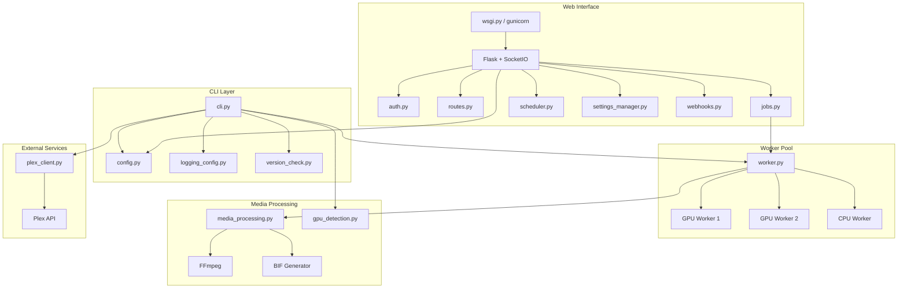
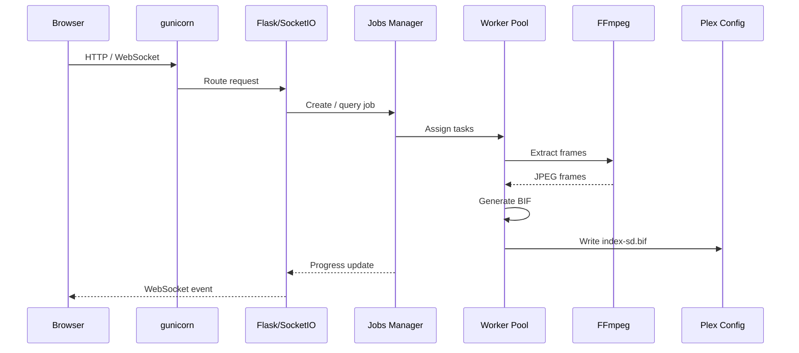
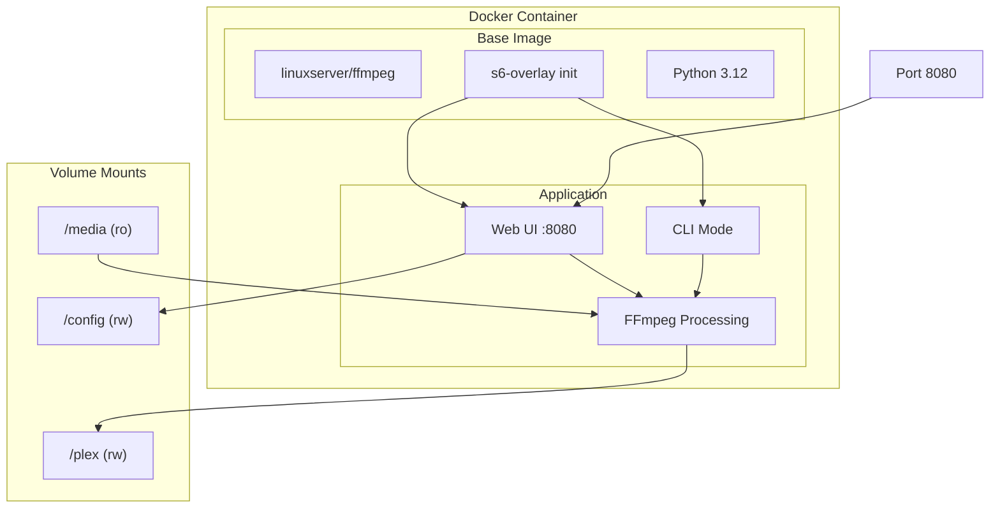

# Documentation

> Plex Generate Previews | [Main README](../README.md)

Use this page to find the right doc quickly based on what you are trying to do.

## Choose Your Path

### I want to install and run it

- Start with [Getting Started](getting-started.md)
- Includes Docker quick start, Docker Compose, GPU setup, Unraid, and local pip install

### I want to operate it in production

- Use [Guides & Troubleshooting](guides.md)
- Includes dashboard usage, webhooks, FAQ, and troubleshooting playbooks

### I need exact settings or API behavior

- Use [Configuration & API Reference](reference.md)
- Includes configuration precedence, environment variables, CLI flags, and REST endpoints

### I want to contribute code

- Start with [Contributing & Development](../CONTRIBUTING.md)
- Includes local setup, tests, style rules, and PR workflow

## Quick Links

| Task | Go To |
|------|-------|
| Fast first run | [Getting Started](getting-started.md#quick-start-docker) |
| Configure GPU acceleration | [Getting Started — GPU](getting-started.md#gpu-acceleration) |
| Configure Unraid | [Getting Started — Unraid](getting-started.md#unraid) |
| Configure webhooks | [Guides — Webhook Integration](guides.md#webhook-integration) |
| Troubleshoot failures | [Guides — Troubleshooting](guides.md#troubleshooting) |
| Check configuration priority | [Reference — Configuration Priority](reference.md#configuration-priority) |
| Review API endpoints | [Reference — REST API](reference.md#rest-api) |

## Scope and Ownership

- [Getting Started](getting-started.md) is the source of truth for installation and initial setup
- [Guides & Troubleshooting](guides.md) is the source of truth for operations and diagnostics
- [Configuration & API Reference](reference.md) is the source of truth for settings and API contracts

## Internal vs User Documentation

The markdown files in `.github/` are maintainer and automation guidance.
They are intentionally not part of end-user product documentation.

## Architecture

### System Architecture

### Web Request Flow

### Docker Container

## API Reference

Full REST API documentation is included in the [Reference](reference.md#rest-api) doc.

---

[Back to Main README](../README.md)
